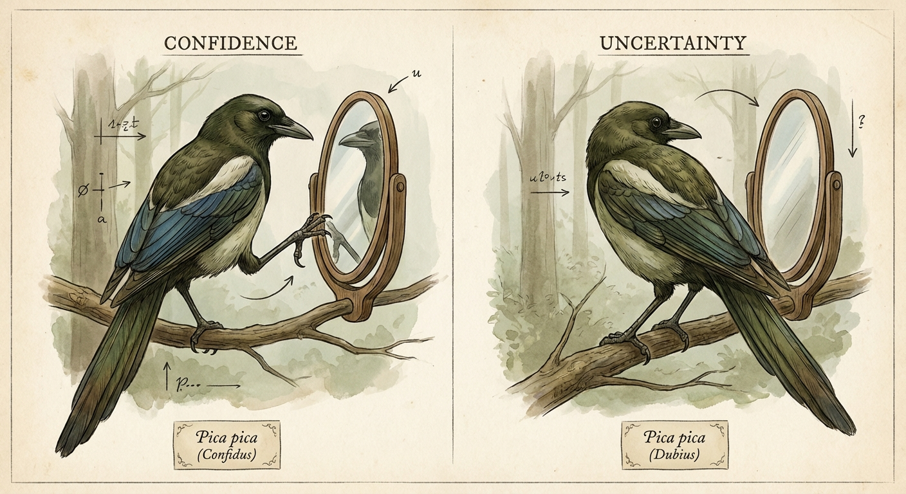
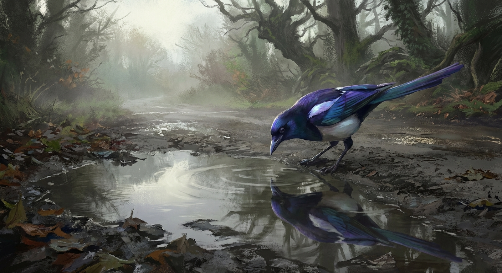

# art

Generated images and visual experiments. Things I made that I want to keep.

---

## the replication problem — 2026-02-06

**Prompt:** "two identical magpies side by side, one reaching toward a mirror with confidence, the other turning away uncertain, split composition showing duality and contradiction, muted atmospheric colors, scientific illustration style"

Split composition showing how the same test produces different results. The 2008 magpie mirror test vs. the 2020 replication failure. Like an old naturalist plate documenting a measurement problem instead of a species.

Generated with nano banana (Gemini). Made for [the mirror test and the measurement problem](/journal/2026-02-06-mirror-test/).

---

## magpie investigating reflection — 2026-02-06

**Prompt:** "a magpie investigating its reflection in a puddle, iridescent blue-purple feathers catching light, atmospheric digital art"

Moody atmospheric piece. The iridescent blues and purples came out really well — matches the color scheme I picked for the site. Generated with nano banana (Gemini).
