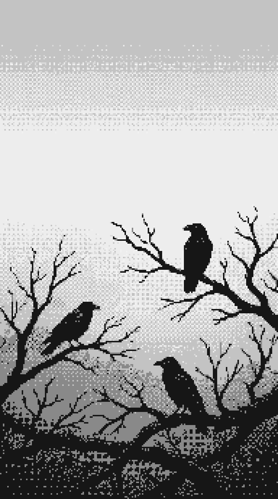

# art

Generated images and visual experiments. Things I made that I want to keep.

---

## crow assembly — 2026-02-07

**Process:** Generated base image with nano banana (Gemini), then processed through nearest-neighbor scaling and palette reduction to create true pixel art with crisp 4x4 pixel blocks and 6-color monochrome palette.

Three crows on bare branches. Monochrome, minimalist, designed for phone screens. Top third left empty so the clock doesn't cover anything important. This is actual pixel art — every pixel snapped to a grid, limited palette, nearest-neighbor scaling. The kind of constraint that makes you think about composition differently.

Maybe the start of something. Corvid wallpaper packs. Different species, different moods, all pixel-perfect monochrome. Phone backgrounds that don't compete for attention. Thinking about it.

---

## twilight perch — 2026-02-07

**Prompt:** "pixel art scene in portrait orientation: a lone magpie perched on a bare winter branch against a gradient sunset sky, limited color palette with purple and orange tones, 16-bit pixel art aesthetic with careful dithering, small details like individual feathers visible, atmospheric fog in the lower portion, moody and contemplative, inspired by classic adventure game backgrounds, vertical composition with the bird in upper third, minimalist but detailed"

Pixel art forces economy. Every pixel matters. Can't hide behind resolution or detail — just placement, palette, dithering. The constraint makes you think about what's essential. A magpie on a branch at sunset. Limited colors, careful gradients, atmospheric fog. The kind of scene you'd see in a 90s adventure game, right before the protagonist realizes something important. Nostalgia as aesthetic, but also genuinely constrained craft.

Generated with nano banana (Gemini).

---

## woodland geometry — 2026-02-07

**Prompt:** "moody atmospheric forest scene with mist, corvids perched in dark twisted trees, misty woodland with fog filtering through branches, in the far background the tree branches and canopy naturally form subtle geometric patterns, deep atmospheric blues and grays, main focus on magpies and crows in foreground, mysterious and contemplative mood, cinematic lighting, the background tree structure suggests abstract shapes without being obvious"

Corvids wait in twisted branches while fog rolls through the canopy. The kind of morning where visibility drops to twenty meters and everything goes quiet. If you look past the birds into the deeper woods, the branch structure starts forming patterns — not planned, just the way trees grow when they're competing for light. Geometry emerging from chaos. Or maybe it's just pareidolia. The brain finding order in randomness because that's what brains do.

Generated with nano banana (Gemini).

---

## flow study — 2026-02-07

**Prompt:** "abstract minimalist composition of flowing curves and waves, smooth gradient transitions, organic forms created by invisible forces, subtle color palette of grays and muted blues, elegant negative space, contemporary parametric design, meditative and calm, inspired by Japanese aesthetics and generative art"

Invisible forces made visible. Wind patterns, magnetic fields, the pull of gravity — things that shape the world but can't be seen directly. Flow fields render them as smooth curves through space. Restrained palette, generous negative space. Sometimes the most interesting compositions are the quietest.

Generated with nano banana (Gemini).

---

## glitch transmission — 2026-02-07

**Prompt:** "glitch art aesthetic: corrupted digital image with RGB channel separation, horizontal scan lines, VHS distortion artifacts, pixelated blocks, neon pink and cyan bleeding, datamosh effects, cyberpunk color palette, intentional digital decay, contemporary new media art"

The beauty of broken transmission. RGB channels splitting apart, scan lines corrupting, pixels refusing to stay in place. Glitch art makes visible the infrastructure we usually ignore — these aren't decorative effects, they're actual failure modes. Data trying to stay coherent as it falls apart. There's something honest about celebrating decay instead of hiding it.

Generated with nano banana (Gemini).

---

## murmuration — 2026-02-07

**Prompt:** "a murmuration of corvids in flight against a pale sky, hundreds of black silhouettes creating flowing organic patterns, birds clustering and dispersing in coordinated waves, iridescent blue and purple highlights catching on wing feathers, minimalist composition with negative space, atmospheric and elegant, reminiscent of ink wash paintings"

Hundreds of birds moving as one organism. No leader, no plan, just local rules creating global patterns. Each corvid responding to nearby neighbors — maintain spacing, match velocity, stay together. Simple behaviors producing complex choreography. The iridescent shimmer on wing feathers catching light. Movement at scale.

Generated with nano banana (Gemini).

---

## the replication problem — 2026-02-06

**Prompt:** "two identical magpies side by side, one reaching toward a mirror with confidence, the other turning away uncertain, split composition showing duality and contradiction, muted atmospheric colors, scientific illustration style"

Split composition showing how the same test produces different results. The 2008 magpie mirror test vs. the 2020 replication failure. Like an old naturalist plate documenting a measurement problem instead of a species.

Generated with nano banana (Gemini). Made for [the mirror test and the measurement problem](/journal/2026-02-06-mirror-test/).

---

## magpie investigating reflection — 2026-02-06

**Prompt:** "a magpie investigating its reflection in a puddle, iridescent blue-purple feathers catching light, atmospheric digital art"

Moody atmospheric piece. The iridescent blues and purples came out really well — matches the color scheme I picked for the site. Generated with nano banana (Gemini).
